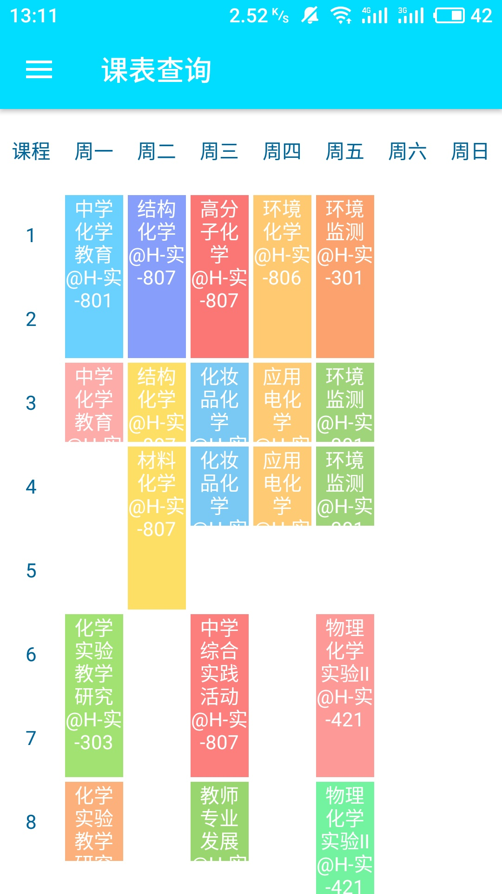
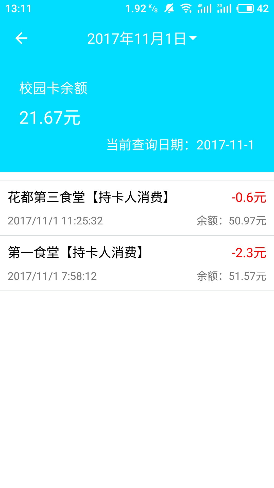
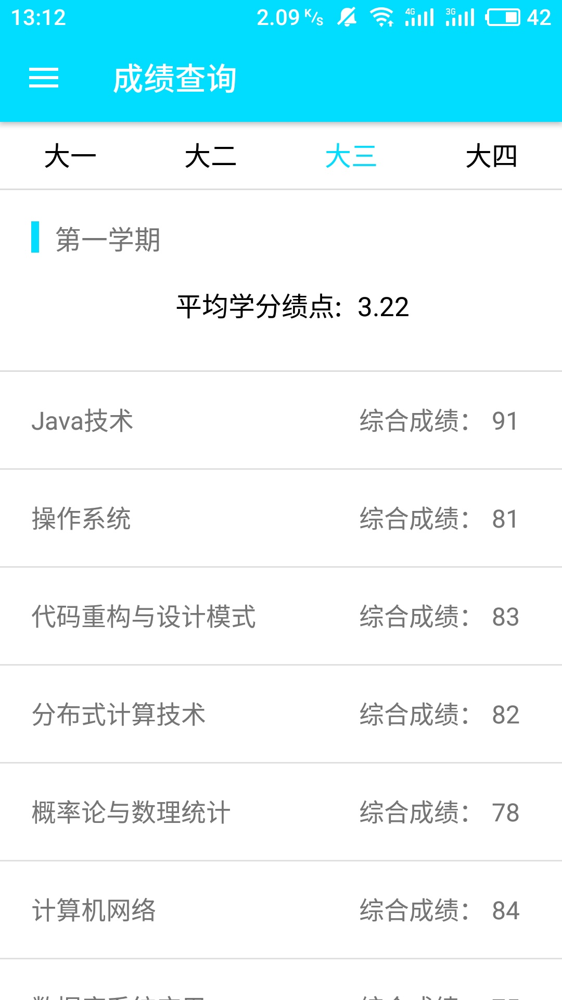

  

# 广东二师助手安卓客户端

**广东第二师范学院校园助手系统安卓原生客户端应用**，兼容Android 9.0，已正式投入校园生产环境供在校师生使用。应用使用了Sophix、JWT、HttpDNS、OKHttp等框架组件，应用主要涉及JSON序列化、数据存储和网络访问等技术。应用的后端API数据接口由广东第二师范学院校园助手系统提供。

## 功能

- 成绩查询
- 课表查询
- 四六级查询
- 一键评教
- 消费查询
- 校园卡充值

## 预览

  
  
  

## 日志

- V3.0.4：调整首页权限和模块加载逻辑
- V3.0.3：修正今日课表模块信息显示不完整的错误
- V3.0.2：调整版本号显示格式	
- V3.0.1：用户昵称过长时使用省略号显示，修正客户端生成数字签名的错误
- V3.0.0：新版广东二师助手安卓客户端发布

## 链接
- [广东二师助手官网](https://gdeiassistant.cn)
- [酷安APP平台下载](https://www.coolapk.com/apk/edu.gdei.gdeiassistant)
- [Google Play下载](https://play.google.com/store/apps/details?id=edu.gdei.gdeiassistant)
- [Amazone Store下载](https://www.amazon.cn/dp/B07932T9V8)

## 相关

广东二师助手安卓客户端的后端API数据接口由[广东第二师范学院校园助手系统](https://github.com/SweetRadish/GdeiAssistant)提供

## 协议

[MIT](http://opensource.org/licenses/MIT)

Copyright (c) 2016 - 2019 GdeiAssistant

## 贡献

- 若你喜欢本项目，欢迎Star本项目

- 要贡献代码，欢迎Fork之后再提交[Pull Request](https://github.com/SweetRadish/GdeiAssistant-Android/pulls)

- 如果你有好的意见或建议，欢迎给我们提交[Issue](https://github.com/SweetRadish/GdeiAssistant-Android/issues)

## 联系

- 邮箱：[gdeiassistant@gmail.com](mailto:gdeiassistant@gmail.com)

## 声明

本项目只用作个人学习研究，如因使用本项目导致任何损失，本人概不负责。
